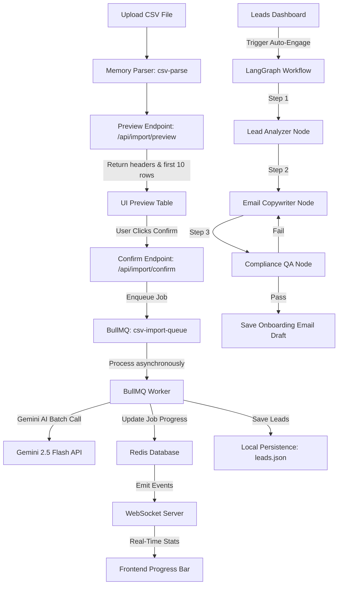

# AI-Driven CRM Data Ingestion & Auto-Engagement System

**Project Status:** 🟢 Production-Grade Features Complete | 🚀 Tested & Verified

This platform is a high-scale, enterprise-ready **AI-Powered CRM Lead Ingestor and Engagement Engine**. It handles massive, irregularly formatted CSV uploads asynchronously and runs intelligent agentic workflows to draft compliance-checked onboarding emails.

---

## 📋 Features

### 1. Asynchronous Task Queue & Real-Time Progress (BullMQ + Redis + WS)
*   **Decoupled Ingestion:** File processing is fully offloaded to a background worker pool using **BullMQ** and **Redis**. The web server remains responsive, preventing request timeouts on large files.
*   **Real-Time Streaming:** The frontend connects via **WebSockets** to subscribe to job progress. The UI renders a dynamic progress bar showing the active batch count and real-time success/skip metrics.
*   **Rate-Limit Protection:** Worker concurrency is set to `1` to prevent hitting downstream LLM provider rate limits (`429 Too Many Requests`).

### 2. Multi-Agent Lead Auto-Responder (LangGraph)
*   **Agentic State Machine:** After leads are successfully parsed and stored in the database, users can trigger an auto-engagement workflow built on **LangGraph**:
    1.  **Lead Analyzer:** Evaluates the lead's company and category to infer target audience and business challenges.
    2.  **Email Copywriter:** Generates a friendly, personalized outreach draft based on retrieved campaign templates.
    3.  **Compliance & QA Guardrail:** Evaluates the draft against strict rules (ensuring no template bracket placeholders, greeting consistency, opt-out notices, and non-spammy tone). If a check fails, the workflow loops back to rewrite up to 3 times.
*   **Draft Review Drawer:** A slide-over review panel on the frontend lets agents inspect, edit, and click "Approve & Send" to finalize emails, updating statuses directly in the CRM database.

---

## 🛠️ Technical Architecture



### Ingestion & Processing Pipeline Flow
```txt
[ CSV Upload ] ──► Preview (csv-parse) ──► UI Table Preview
                                                │ (Confirm)
                                                ▼
                                       [ BullMQ Queue ] ──► Return Job ID
                                                │
                                        (Async Worker)
                                                │
                                                ├──► Gemini 2.5 Flash API (AI Mapping)
                                                ├──► Zod Normalization & Validation
                                                ├──► Save to leads.json database
                                                └──► Stream progress updates via WebSocket
```

---

## 🚀 How to Run Locally

### 1. Start Redis
Make sure a local Redis server is running, or get a remote endpoint.

**Using Docker (Recommended):**
```bash
docker run -d --name crm-redis -p 6379:6379 redis
```

**Using Upstash (Cloud):**
Sign up at [Upstash](https://upstash.com/), create a free Redis database, and copy the endpoint host, port, and password.

---

### 2. Configure & Run the Backend
Go to the `backend` folder:
```bash
cd backend
npm install
cp .env.example .env
```

Configure your `.env` variables:
```env
PORT=5001
FRONTEND_URL=http://localhost:3000
AI_PROVIDER=gemini
GEMINI_API_KEY=your_gemini_api_key
GEMINI_MODEL=gemini-2.5-flash
AI_BATCH_SIZE=25
MAX_FILE_SIZE_MB=5

# Redis Configuration (For BullMQ queues)
REDIS_HOST=localhost
REDIS_PORT=6379
REDIS_PASSWORD=
```
*(Note: If using Upstash, set your `REDIS_HOST` to your clean hostname, e.g. `your-db.upstash.io`, set `REDIS_PORT=6379`, and fill in `REDIS_PASSWORD`)*

Start the backend:
```bash
npm run dev
```
*(The backend will automatically start the background queue worker and attach the WebSocket server).*

Run backend verification tests:
```bash
npm test
```
*(Runs 18 unit tests covering CSV parser, date/phone normalizations, AI extraction, Lead Store persistence, and LangGraph mock executions).*

---

### 3. Configure & Run the Frontend
Go to the `ui-frontend` folder:
```bash
cd ../ui-frontend
npm install
cp .env.local.example .env.local
```

Ensure the backend API target is set in `.env.local`:
```env
NEXT_PUBLIC_API_BASE_URL=http://localhost:5001
```

Start the frontend:
```bash
npm run dev
```
Open **`http://localhost:3000`** in your browser.