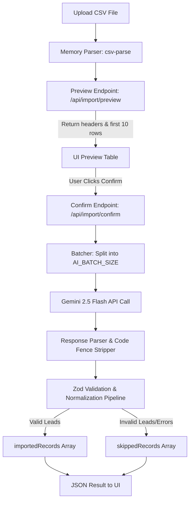

# AI-Driven-CRM-Data-Ingestion-System

**Project Status:** 🟢 Backend Complete & Verified | 🟡 Frontend In Progress

---

## 📋 Product Overview (For Product Owners)

In B2B and CRM platforms, customer upload lists come in highly irregular formats. Column headers like `Full Name`, `lead`, `customer`, `tel`, `whatsapp`, `mail`, or `submitted_at` make standard hard-coded import templates break.

This application is an **AI-Powered CRM Lead Ingestor**. It allows users to upload **any valid CSV file** with **any layout or column naming convention**.
1. **Instant Preview:** The system immediately parses the uploaded file and shows a preview table of the raw records (done locally on the server in milliseconds, costing $0 in AI fees).
2. **AI-Powered Mapping:** Once the user reviews and confirms, the records are sent to Gemini AI in optimal batch sizes. The AI maps the mismatched headers, cleans the fields, resolves multiple values, and assigns standard values.
3. **Data Safety Guardrails:** Strict post-AI validation checks discard low-quality leads and format phone numbers and dates to a single consistent CRM standard.

---

## 🛠️ Technical Architecture & Pipeline



### 📊 Ingestion Pipeline Flow (Text Representation)
```txt
[ Upload CSV ] 
      │
      ▼
[ Memory Parser (csv-parse) ] ───► Preview: /api/import/preview ───► Mapped UI Preview Table
                                                                             │ (Click Confirm)
                                                                             ▼
                                                                 Confirm: /api/import/confirm
                                                                             │
                                                                             ▼
                                                                 [ Split into Batches ]
                                                                             │
                                                                             ▼
                                                                 [ Gemini 2.5 Flash API ]
                                                                             │
                                                                             ▼
                                                                 [ JSON Code Fence Stripper ]
                                                                             │
                                                                             ▼
                                                                 [ Zod Validator & Normalizer ]
                                                                   ├── Verify Email / Mobile exists
                                                                   ├── Format Date to ISO string
                                                                   └── Normalize Phone with Country Code
                                                                             │
                                                                     ┌───────┴───────┐
                                                                     ▼               ▼
                                                              [Valid Leads]   [Skipped Leads]
                                                              (Imported list)  (Reason details)
```

### 1. The CSV Parse Engine
* Reads files in-memory using `multer.memoryStorage()`. No temporary disk-space leak or container security threat from persistent filesystem writes.
* Handled via standard RFC 4180 streaming rules—supporting double quotes, commas inside fields, and empty column buffers.

### 2. The Gemini AI Context Mapping (Model: `gemini-2.5-flash`)
* We utilize **Gemini 2.5 Flash** with low temperature configuration (`0.1`) to ensure highly deterministic outputs.
* Prompt directives guide the model to understand alternative headers, identify enums (statuses, campaign tags), map multi-value fields (e.g. secondary email goes to `crm_note`), and format fields.

### 3. Zod Post-Validation Guardrail
To prevent LLM hallucination or schema deviation, all output fields run through a post-AI validation pipeline:
* **Contact Requirement:** If a lead lacks both `email` and `mobile_without_country_code`, it is rejected and pushed to `skippedRecords` with the reason: `Missing both email and mobile number`.
* **Phone Normalization:** Applies regex filters to format international and Indian numbers (correcting `+91`, `91`, `0` prefixes).
* **Date Normalization:** ISO conversions ensure that standard JavaScript constructors `new Date(created_at)` never return `NaN`.
* **Resilient Batches:** If one batch fails (due to external rate limits or token limits), the orchestrator captures the error and places all records of that batch in the `skippedRecords` array with the detailed failure description, continuing the loop for the remaining batches.

---

## 🚀 How to Run the Backend Locally

### 1. Install & configure
```bash
cd backend
npm install
cp .env.example .env
```
Inside `.env`, configure your Gemini API Key:
```env
PORT=5001
GEMINI_API_KEY=your_api_key_here
GEMINI_MODEL=gemini-2.5-flash
AI_PROVIDER=gemini
AI_BATCH_SIZE=25
```

### 2. Start the service
```bash
npm run dev
```

### 3. Verification
Run the unit test suite:
```bash
npm test
```
*(All 14 core tests verify CSV parsing, phone/date normalization, mock fallback mode, and batching logic).*